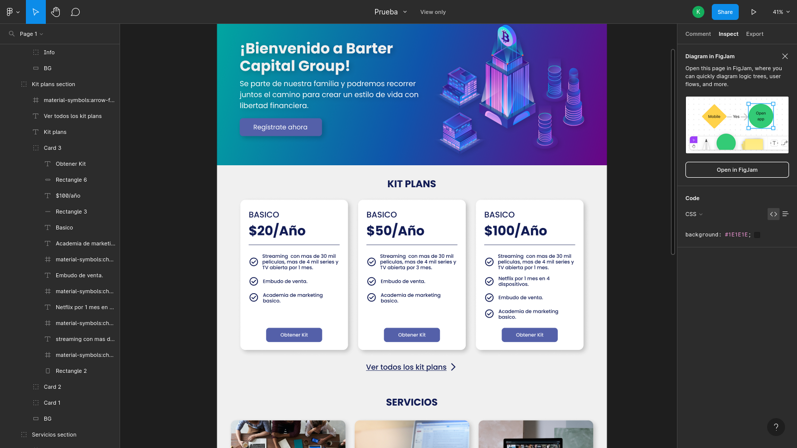

# Prueba técnica con módulos de React y Tailwindcss

Este proyecto es una prueba técnica que utiliza módulos de React y Tailwindcss para crear una aplicación web.

# Test de Figma a realizar

# Prueba realizada en este repositorio 

